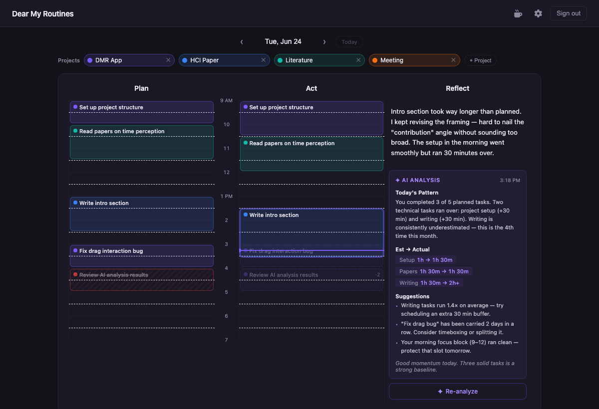
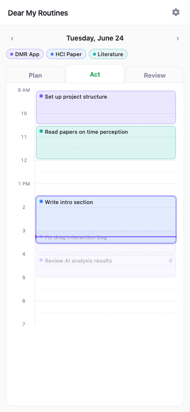

# Dear My Routines

**예상 vs. 실제** 시간을 매일 눈에 보이게 만드는 개인용 시간관리 웹앱.
만성적인 시간 과소예측을 고치기 위해 만들었어요.

아침에 하루를 계획하고 → 실제로 어떻게 됐는지 기록하고 → 저녁에 AI 리뷰로 내 패턴을 파악합니다.

> **상태:** 호스팅 버전은 종료했습니다. 코드는 오픈소스(MIT)라서 무료 Supabase 프로젝트로 직접 띄워 쓸 수 있어요. [직접 실행하기](#직접-실행하기) 참고.

---

## 스크린샷

### 데스크톱 — Plan · Act · Review (라이트 모드)


### 데스크톱 — 다크 모드



### 모바일 — Act 탭



---

## 어떻게 쓰나요?

하루를 세 순간으로 나눕니다:

| 패널 | 시점 | 하는 일 |
|------|------|---------|
| **Plan** | 아침 | 할 일을 브레인덤프하고, 시간 슬롯에 배치하고, *예상* 시간을 입력 |
| **Act** | 낮 | 블록을 드래그해서 순서 변경, 리사이즈로 시간 조정, 새 작업 즉석 추가 |
| **Review** | 밤 | 짧은 일기 작성 → **AI 분석** 버튼 → 오늘의 패턴 리포트 확인 |

**Plan과 Act는 같은 시간 축을 공유**하기 때문에, 예상 1시간짜리가 실제로 1시간 반이 걸리면 오른쪽 블록이 왼쪽보다 더 길게 보입니다. 시간 초과가 즉시 눈에 들어오죠.

### 핵심 기능

- **예상 vs. 실제 비교** — Plan과 Act 블록이 같은 시간 축 위에 나란히 서 있어서, 시간 초과가 시각적으로 바로 보입니다.
- **고스트 블록** — 아직 실행 안 한 계획이 Act 컬럼에 흐릿한 점선 윤곽으로 나타납니다. 클릭하면 실행 확정, ✕를 누르면 다음 날로 이월.
- **이월 횟수 배지** — 미루고 또 미루면 조용히 ·2, ·3 배지가 붙고, 4회 이상이 되면 주황색으로 바뀌어 "이거 혹시 프로젝트 아냐?"를 넌지시 알려줍니다.
- **현재 진행 중 하이라이트** — 지금 이 순간 진행 중인 블록에 컬러 링이 표시됩니다.
- **데일리 AI 리뷰** — 오늘의 일기 + 누적 시간 데이터를 바탕으로 패턴 요약, 작업별 예상→실제 비율, 구체적인 제안을 제공합니다.
- **프로젝트 컬러 코딩** — 작업은 소속 프로젝트의 색을 그대로 상속합니다. 상단 레전드로 어떤 블록이 어느 프로젝트인지 한눈에 파악.
- **다크 / 라이트 테마** — 헤더에서 전환 가능.
- **모바일 대응** — 소형 화면에서는 Plan · Act · Review가 탭 형태로 전환됩니다.

---

## 기술 스택

- **Next.js 15** (App Router) + **TypeScript** (strict)
- **Tailwind CSS** + shadcn/ui
- **dnd-kit** + Framer Motion (블록 인터랙션)
- **TanStack Query** + 낙관적 업데이트 (서버 응답을 기다리지 않아요)
- **Supabase** — Postgres + 매직링크 인증 + RLS
- **Drizzle ORM**
- **Vercel AI SDK** — 모델 비종속 (OpenAI / Gemini 교체 가능)
- **Railway** (호스팅), **Vitest** (테스트)

---

## 직접 실행하기

1. [Supabase](https://supabase.com) 프로젝트를 만들고 이메일 인증을 켭니다 (Google OAuth는 선택).
2. `.env.example`을 `.env`로 복사하고 Supabase URL, publishable key, DB 비밀번호, Gemini API 키를 채웁니다. `RESEND_API_KEY`는 피드백·공지 메일에만 필요해요.
3. DB 스키마(테이블 + RLS 정책)를 적용합니다:

   ```bash
   npm install
   npx drizzle-kit migrate
   ```

   `drizzle.config.ts`는 Supabase `us-west-2` session pooler를 가리킵니다. 리전이 다르면 `host`를 바꿔 주세요.
4. 가입은 초대제입니다. Supabase SQL 에디터에서 내 이메일을 허용 목록에 넣어요:

   ```sql
   insert into allowed_emails (email, role) values ('you@example.com', 'admin');
   ```

5. 실행:

   ```bash
   npm run dev     # 개발 서버  →  http://localhost:3000
   npm run build   # 프로덕션 빌드
   npm run test    # Vitest 유닛 테스트
   npm run lint    # ESLint
   ```

Railway에 배포하고 싶다면 참고용으로 `railway.toml`을 남겨 뒀습니다.

---

## 아키텍처 메모

- 모든 AI 호출은 Vercel AI SDK를 통해서만 — provider SDK 직접 호출 금지 (모델 비종속 유지).
- 모든 DB 테이블에 `user_id` + RLS — 클라이언트 직접 쿼리도 안전.
- 비즈니스 로직(시간 계산, 통계, 이월, AI 프롬프트)은 `src/core/`의 순수 함수로 분리.
- Server Component 기본, 인터랙션이 필요한 곳만 `'use client'`.

아키텍처 결정 기록은 [`docs/ADR.md`](docs/ADR.md), 전체 구조는 [`docs/ARCHITECTURE.md`](docs/ARCHITECTURE.md) 참고.

---

## 라이선스

[MIT](LICENSE)

---

## English version

[English README →](README.md)
